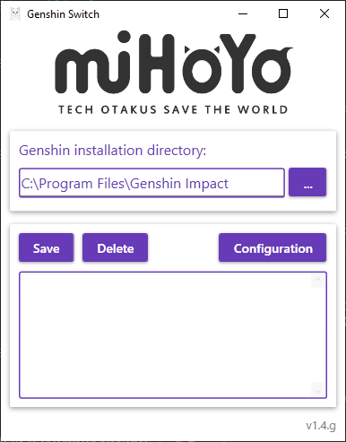

#  Genshin Impact Account Switching Tool

Chinese server version:

Global server version:

GenshinSwitch
PC version of the Global server Genshin Impact account switching tool

## Screenshot

## Runtime Environment

-  Windows 7 or greater
- .NET Framework 4.8

## How to use

1. Log in to game account #1 and click save. For example, save as "Account A"
2. Log out, log in to game account #2 and click save. For example, save as "Account B"
3. Double click on the saved account to log in automatically

## Notes

- Administrator rights are required because the game also needs administrator rights to run.
- Mouse hover to see the tooltips
- Right click on the selected account for additional options: 
    - Delayed start (automatically start after 3 minutes, it's convenient to cycle through the world Boss materials)
    - No start (doesn't start Genshin Impact, useful if you use Steam or another launcher)
- Please backup the configuration file before updating the version

## Compiling

Required tools: `VS2022` `7z` `dotNET_Reactor`

Note that you need administrator privileges to compile, it is recommended to compile in VS and then execute the following script.

`Costura.Fody` is used to bundle into a single executable file.

Script: [app_build.bat](app_build.bat)

## Version history

- **v1.3.g**  `2022-03-12`

> 1. English tranlation
> 1. Update registry keys and paths for global release
> 1. Swap from `dotNET_Reactor` to `Costura.Fody` to bundle into a single exe

- **v1.3**  `2022-01-23`

>1. 增加支持快捷方式lnk格式
>
>   ※手动输入原神快捷方式路劲即可，这样可用于自定义启动命令

- **v1.2**  `2022-01-16`

> 1. 追加单文件编译版本
> 1. 修改容易被小盾牌遮挡的程序图标
> 1. 支持安装路劲填写具体exe、bat、cmd后缀文件（可用于解锁FPS等方式的启动）

- **v1.1**  `2022-01-05`

>1. 修改托盘按钮双击命令
>2. 程序现在只能启动一个单例
>3. 关闭按钮不再自动最小化到托盘
>4. 选中账号右键可以使用缓启动（自动3分钟后启动，方便循环打大世界Boss材料）

- **v1.0**  `2022-01-01`

>1. 初版

